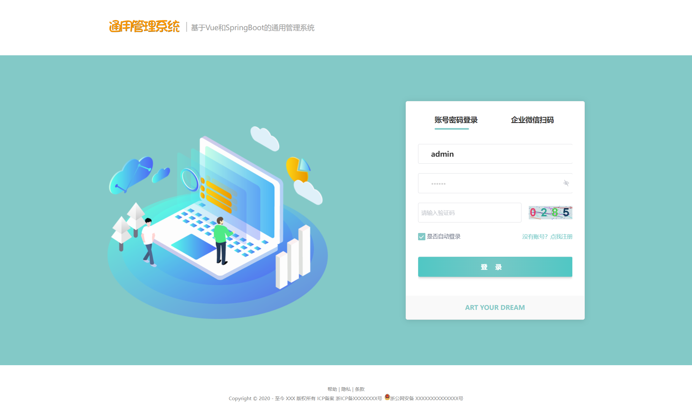
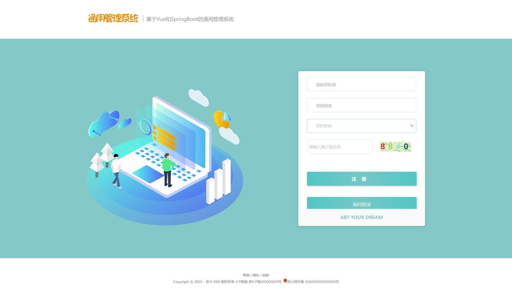
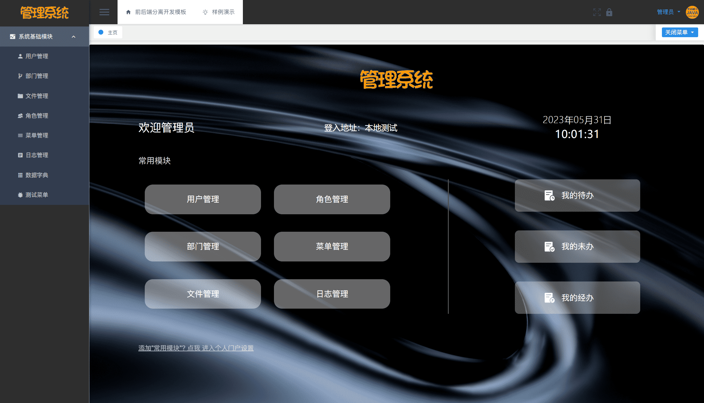
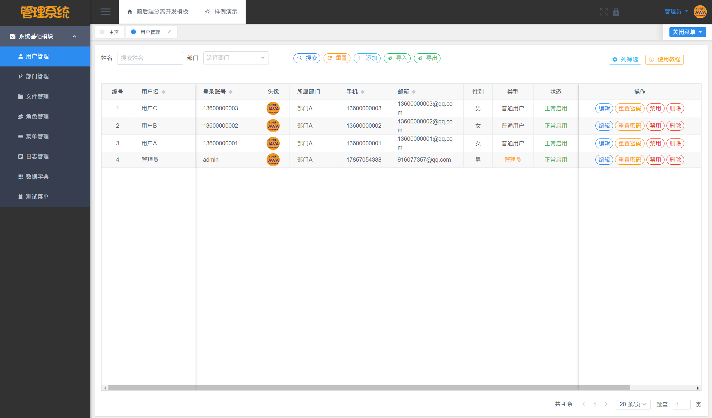
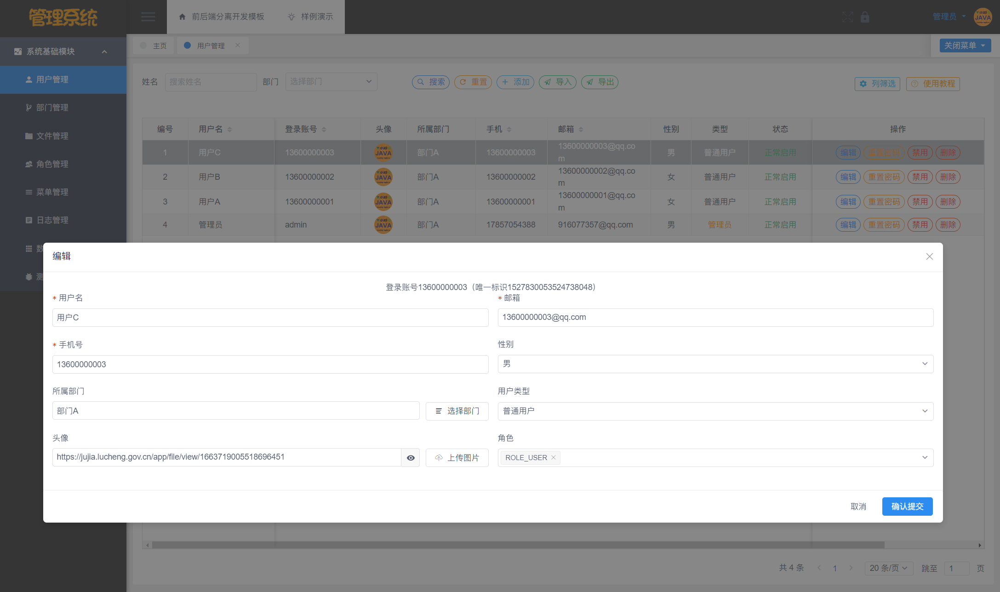
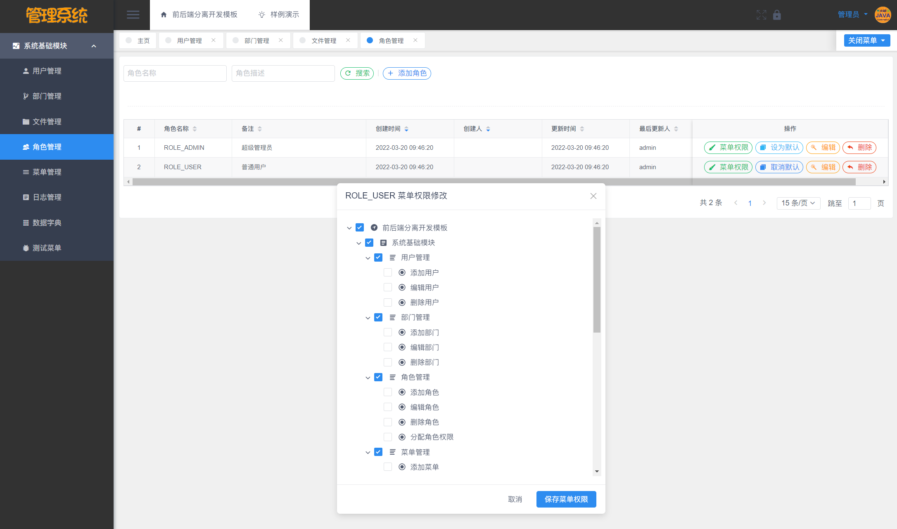
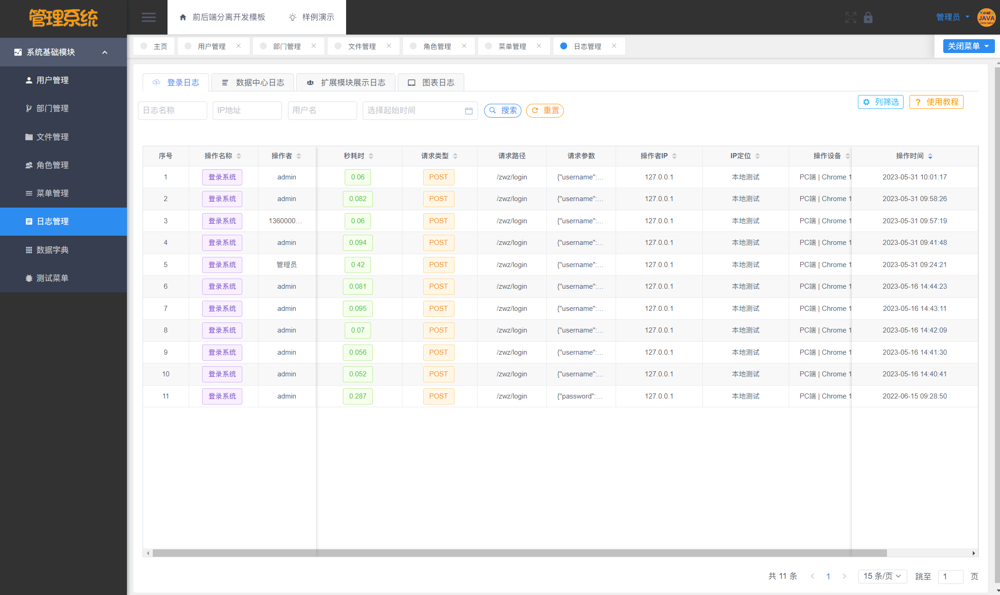

# 用一份模板，开发 200+ 套毕设项目

## 软件简介

本软件是**基于 Vue 和 SpringBoot 的通用管理系统**，包含了**登陆注册、用户管理、部门管理、文件管理、权限管理、日志管理、个人中心、数据字典和代码生成**这九个功能模块，另外还有两张样例数据表和五张样例数据图，是一个很好的前后端分离开发模板，开发者可以在这个模板上进行二次开发，只需要实现需求方的业务逻辑，即可快速成型甲方的业务需求。

本系统采用了**基于角色的访问控制**，角色和菜单关联，一个角色可以配置多个菜单权限；然后再将用户和角色关联，一位用户可以赋予多个角色。这样用户就可以根据角色拿到该有的菜单权限，更方便管理者进行权限管控。

本系统还**封装了文件管理功能**，在其他模块如若要实现图片/文件上传预览时，前端只需导入现成的 Vue 组件即可实现（使用 viewerjs 依赖实现），后端只需定义 String 类型的实体类变量即可，无需再去研究文件上传预览的相关功能，简化了开发者的工作量。

本系统还自带**基于 beetl 代码生成器**功能，开发者只需要输入类名（如 Student）和类备注（如学生），运行 main 函数即可自动生成后端的所有 MVC 结构代码，无需开发增删改查的 API 接口。对于前端，开发者只需输入后端实体类的完整路径，利用 Java 的反射原理，拿到后端实体类的字段，即可自动生成前端所有代码，生成的模块代码包含基础的增删改查功能，简化开发者的工作量。

## 部署说明

前端： **Node.js 18，Vue 2.7.10，组件库 View UI 4.7**（如使用低版本 node，需自行降低 plugin 版本）。

后端：**JDK 17 及以上版本，Maven 3.6，SpringBoot 3.1.0，mybatis-plus 3.5.3.1**（因 SpringBoot 3 最低支持 JDK 17，所以项目不支持 JDK 8）。

数据库：**MySQL 8.0.33，Redis 5.0.14**（MySQL5.7 需要手动设置编码 UFT8，并修改 sql 文件编码，否则 a_user 表数据无法导入导致用户不能登录）。

```javascript
// 前端（VsCode）
// 1. 下载安装 Node.js（18 版本）
// 2. 安装 Vue 脚手架
npm i -g @vue/cli
// 3. 安装前端依赖
npm i
// 4. 启动前端项目
npm run dev

// 后端（Idea）
// 1. 导入项目
// 2. 配置 Maven、开启redis（否则系统无法启动）
// 3. 导入数据库，建议 MySQL8，若 5.7 版本需设置编码为 UTF-8，否则会提示密码错误
// 4. 等待后端依赖下载，完成后启动项目，或编译后执行 mvn spring-boot:run
// 如有问题可以参考启动教学视频：https://www.bilibili.com/video/BV1a24y1m7Kv
```

## 免责声明

- 本项目开源，仅供个人学习使用，遵循 GPL-3.0 开源协议，**商用授权请联系作者，否则后果自负**。
- 作者拥有本软件构建后的应用系统全部内容所有权及独立的知识产权（**软件著作权登记号：2022SR1338865**）。
- 如有问题，欢迎在仓库 Issue 留言，看到后会第一时间回复。相关意见会酌情考虑，但没有一定被采纳的承诺或保证。

下载本系统代码的用户，**必须同意以下内容，否则请勿下载**！

1. 出于自愿而使用/开发本软件，了解使用本软件的风险，且同意自己承担使用本软件的风险。
2. 利用本软件构建的网站的任何信息内容以及导致的任何版权纠纷和法律争议及后果和作者无关，作者对此不承担任何责任。
3. 在任何情况下，对于因使用或无法使用本软件而导致的任何难以合理预估的损失（包括但不仅限于商业利润损失、业务中断与业务信息丢失），作者概不承担任何责任。
4. 必须了解使用本软件的风险，作者不承诺提供一对一的技术支持、使用担保，也不承担任何因本软件而产生的难以预料的问题的相关责任。

## 软件架构分析

基于 Vue 和 SpringBoot 的通用管理系统包括了**登陆注册、用户管理、部门管理、文件管理、权限管理、日志管理、个人中心、数据字典和代码生成**这九大功能模块，其架构如下图所示。

 

下面是系统截图，相信聪明的读者都能看懂！


















## 现有成品

使用该模板开发的开源系统名单如下。

- 基于 Vue 和 SpringBoot 的大病保险管理系统 <https://gitee.com/yyzwz/medicineSystem>
- 基于 Vue 和 SpringBoot 的超市账单管理系统 <https://gitee.com/yyzwz/bill-system>
- 基于 Vue 和 SpringBoot 的通讯录管理系统 <https://gitee.com/yyzwz/address-book-system>
- 基于 Vue 和 SpringBoot 的假日旅社管理系统 <https://gitee.com/yyzwz/holiday-hotel>
- 基于 Vue 和 SpringBoot 的 OA 系统 <https://gitee.com/yyzwz/hostel>
- 基于 Vue 和 SpringBoot 的医院门诊预约挂号系统 <https://gitee.com/yyzwz/order-register>
- 基于 Vue 和 SpringBoot 的资产采购管理系统 <https://gitee.com/yyzwz/asset-purchase>

未来将会开发出更多的管理系统，敬请期待！
