# 【前后端分离开发模板】基于 Vue 和 SpringBoot 的通用管理系统

## 软件简介

本软件是**基于 Vue 和 SpringBoot 的通用管理系统**，包含了**登陆注册、用户管理、部门管理、文件管理、权限管理、日志管理、个人中心、数据字典和代码生成**这九个功能模块，另外还有两张样例数据表和五张样例数据图，是一个很好的前后端分离开发模板，开发者可以在这个模板上进行二次开发，只需要实现需求方的业务逻辑，即可快速成型甲方的业务需求。

本系统采用了**基于角色的访问控制**，角色和菜单关联，一个角色可以配置多个菜单权限；然后再将用户和角色关联，一位用户可以赋予多个角色。这样用户就可以根据角色拿到该有的菜单权限，更方便管理者进行权限管控。

本系统还**封装了文件管理功能**，在其他模块如若要实现图片/文件上传预览时，前端只需导入现成的 Vue 组件即可实现（使用 viewerjs 依赖实现），后端只需定义 String 类型的实体类变量即可，无需再去研究文件上传预览的相关功能，简化了开发者的工作量。

本系统还自带**基于 beetl 代码生成器**功能，开发者只需要输入类名（如 Student）和类备注（如学生），运行 main 函数即可自动生成后端的所有 MVC 结构代码，无需开发增删改查的 API 接口。对于前端，开发者只需输入后端实体类的完整路径，利用 Java 的反射原理，拿到后端实体类的字段，即可自动生成前端所有代码，生成的模块代码包含基础的增删改查功能，简化开发者的工作量。

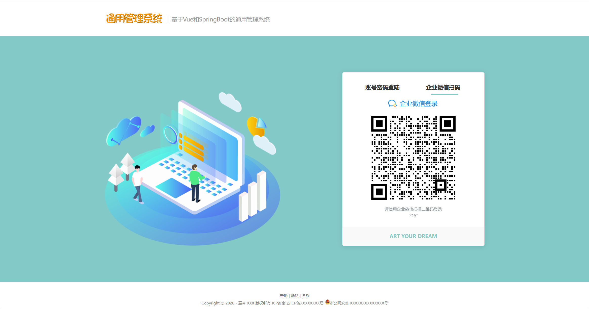

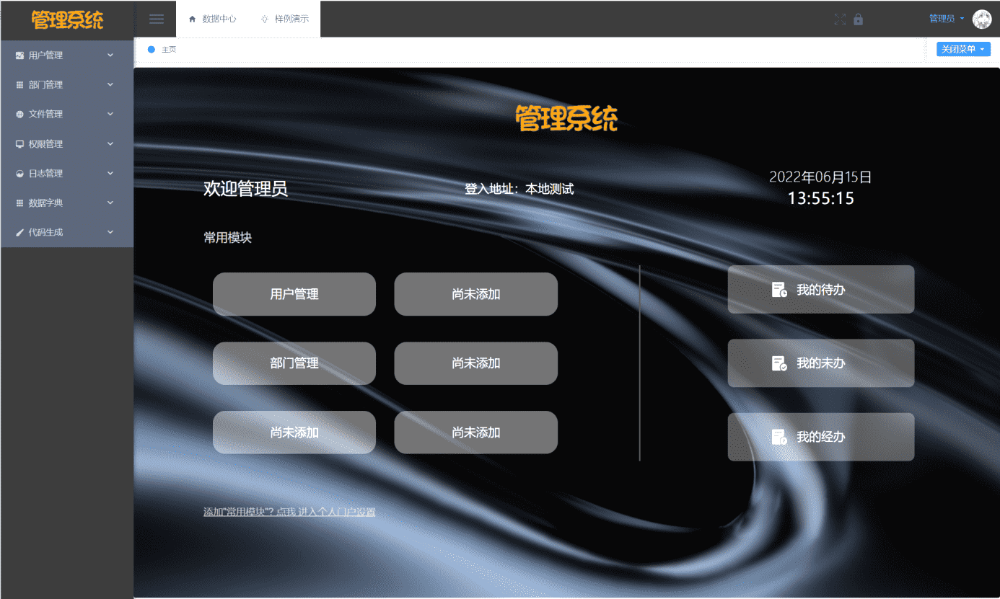

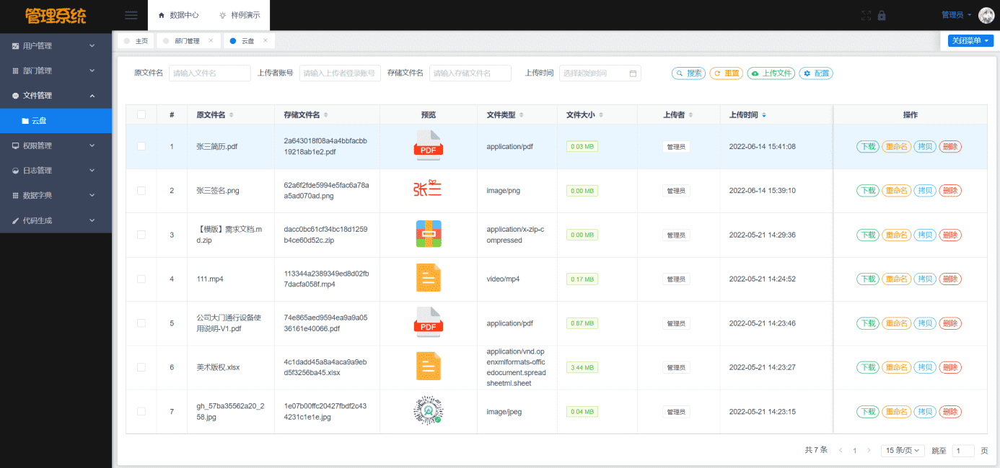

## 现有成品

使用该模板开发的管理系统名单如下。

- 基于 Vue 和 SpringBoot 的大病保险管理系统 <https://gitee.com/yyzwz/medicineSystem>
- 基于 Vue 和 SpringBoot 的超市账单管理系统 <https://gitee.com/yyzwz/bill-system>
- 基于 Vue 和 SpringBoot 的通讯录管理系统 <https://gitee.com/yyzwz/address-book-system>
- 基于 Vue 和 SpringBoot 的假日旅社管理系统 <https://gitee.com/yyzwz/holiday-hotel>
- 基于 Vue 和 SpringBoot 的 OA 系统 <https://gitee.com/yyzwz/hostel>
- 基于 Vue 和 SpringBoot 的医院门诊预约挂号系统 <https://gitee.com/yyzwz/order-register>
- 基于 Vue 和 SpringBoot 的资产采购管理系统 <https://gitee.com/yyzwz/asset-purchase>

未来将会开发出更多的管理系统，敬请期待！

## 部署说明

```javascript
// 前端（VsCode）
// 1. 下载安装 Node.js（18 版本）和 VsCode
// 2. 卸载原 Vue 脚手架（可选）
npm uninstall -g @vue/cli
// 3. 安装 Vue 脚手架
npm install -g @vue/cli
// 4. 安装淘宝镜像（可选）
npm install -g cnpm --registry=http://registry.npm.taobao.org
npm config set registry https://registry.npm.taobao.org
// 5. 安装前端依赖
npm i
// 6. 启动前端项目
npm run dev

// 后端（Idea）
// 1. 导入项目
// 2. 配置 Maven
// 3. 导入数据库，建议 MySQL8，若 5.7 版本需设置编码为 UTF-8
// 4. 等待后端依赖下载，完成后启动项目，或编译后执行 mvn spring-boot:run
```

## 更新日志

V1.1.1 2022-09-09

修复按钮级菜单权限无法添加的问题。

V1.1.0 2022-09-02

软件著作权申请通过，《基于 Vue 和 SpringBoot 的通用管理系统》正式开源。

## 软件技术选型

### 前端

lVue：Vue 是构建前端界面的核心框架，本系统采用 2.6.14 版本。

View UI：基于 Vue.js 2 的组件库，本系统采用 4.7.0 版本。

### 后端

- Spring Boot：构建系统核心逻辑的后端框架，本系统采用 2.7.3 版本。
- MyBatis Plus：后端连接数据库的框架，本系统采用 3.5.2 版本。

### 数据库

- MySQL：本项目的主数据库，本系统采用 8.0.30 版本。
- Redis：本系统采用基于 Windows 版本的 Redis，用于图形验证码和用户菜单权限的临时存储，采用了 5.0.14.1 版本。

### 开发环境

- VsCode：项目前端的开发工具，使用版本为 1.68.0。
- IntelliJ IDEA ：项目后端的开发工具，使用版本为 2022.2.1。
- JDK：Java 的开发环境，使用版本为 17.0.4.1。
- Maven：后端项目的打包工具，使用版本为 3.6.2。
- NodeJs：前端项目的开发环境，使用版本为 16.13.0。

### 图表(Antv)

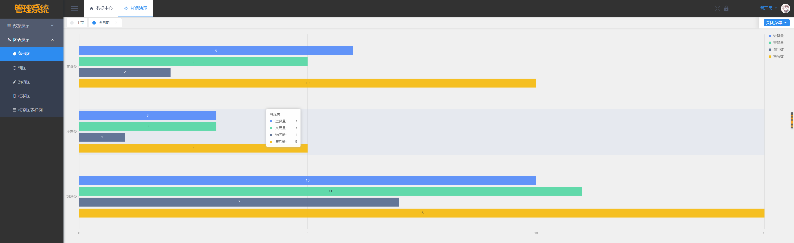

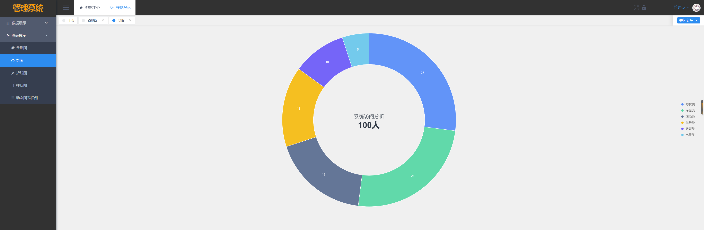

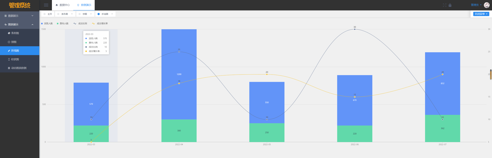

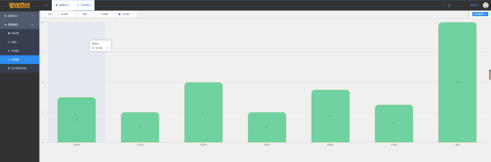

## 软件架构分析

基于 Vue 和 SpringBoot 的通用管理系统包括了**登陆注册、用户管理、部门管理、文件管理、权限管理、日志管理、个人中心、数据字典和代码生成**这九大功能模块，其架构如下图所示。

 


接下来，分别对九大模块进行详细介绍。

## 登陆注册模块

登陆注册模块用于实现用户的登陆功能和注册功能，用户在登陆时需要输入登陆账号、密码和图形验证码，系统效验无误后即可进入系统，登陆流程图如下所示。


系统的登陆界面如下所示。

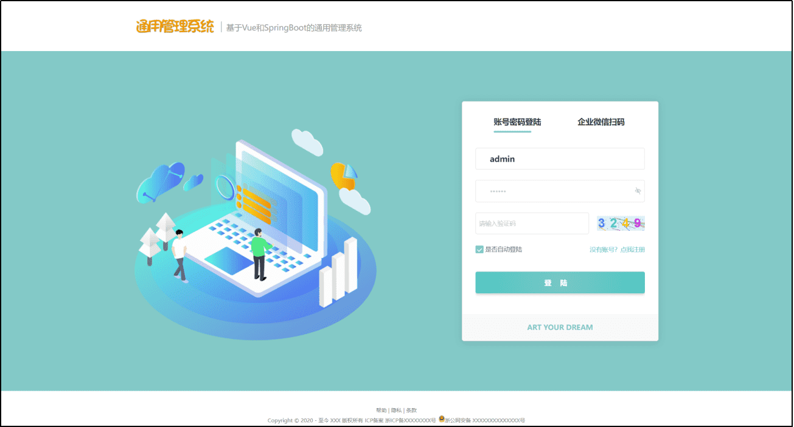

当用户没有输入验证码，系统会提示“验证码不能为空”，如下图所示。

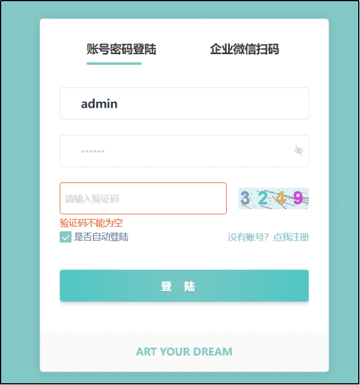

当用户输入了错误的验证码，系统会提示“验证码不正确”，如下图所示。


当用户输入了错误的账号密码，系统会提示“账号密码不正确”，如下图所示。

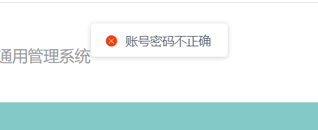

图形验证码默认有效期为 2 分钟，如用户超过 2 分钟没有刷新验证码，验证码将会失效，系统会给与以下提示。

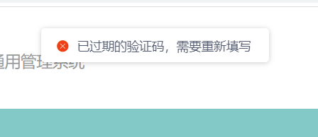

```java
// 用户登陆前端判断代码
submitLogin() {
    this.$refs.usernameLoginForm.validate(valid => {
        if (valid) {
            this.loading = true;
            login({
                username: this.form.username,
                password: this.form.password,
                code: this.form.imgCode,
                captchaId: this.captchaId,
                saveLogin: this.saveLogin
            }).then(res => {
                if (res.success) {
                    this.afterLogin(res);
                } else {
                    this.loading = false;
                    this.getCaptchaImg();
                }
            });
        }
    });
}
```

用户在注册时，需要提供手机号、登陆密码和图形验证码，系统效验无误后即可完成注册，再跳转到登陆界面，注册的流程图如下所示。

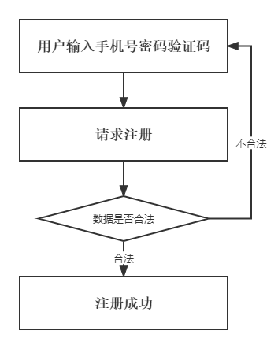

系统的注册界面如下图所示，用户需要输入手机号、姓名、密码和图形验证码完成注册。

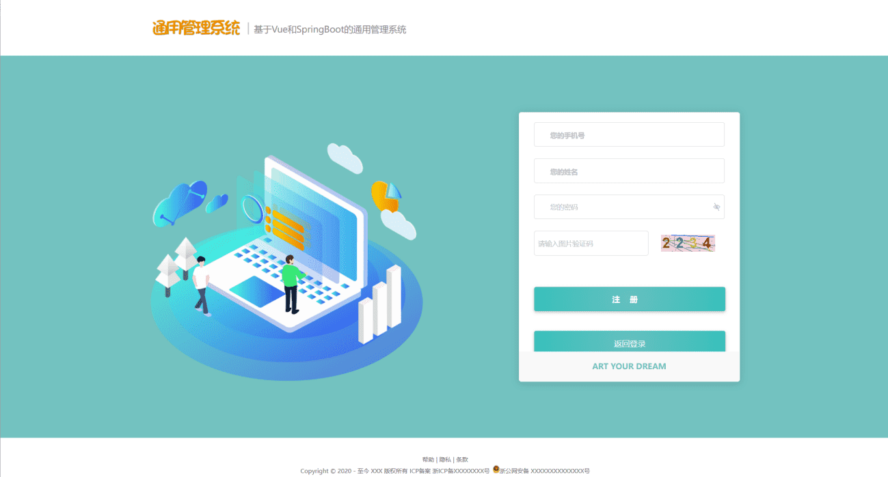

```java
// 用户注册前端判断代码  
submitRegist() {
    this.form.captchaId = this.captchaId;
    this.form.mobile = this.form.username;
    this.$refs.usernameLoginForm.validate(valid => {
        if (valid) {
            if (!this.form.code) {
                this.errorCode = "验证码不能为空";
                return;
            } else {
                this.errorCode = "";
            }
            this.loading = true;
            regist(this.form).then(res => {
                this.loading = false;
                if (res.success) {
                    this.$router.push({
                        name: "login"
                    });
                } 
            });
        }
    });
}
```

## 用户管理模块

用户管理模块用于实现对系统用户的添加、修改、删除、查询功能，其功能结构图如下所示。

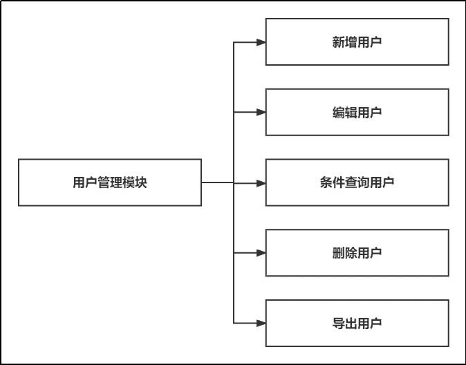

用户实体类的字段明细如下：

- 登陆账号

- 登陆密码

- 手机号

- 部门

- 性别

- 家庭地址

- 用户类型

- 用户状态

- 用户管理

用户管理模块的操作界面如下所示。

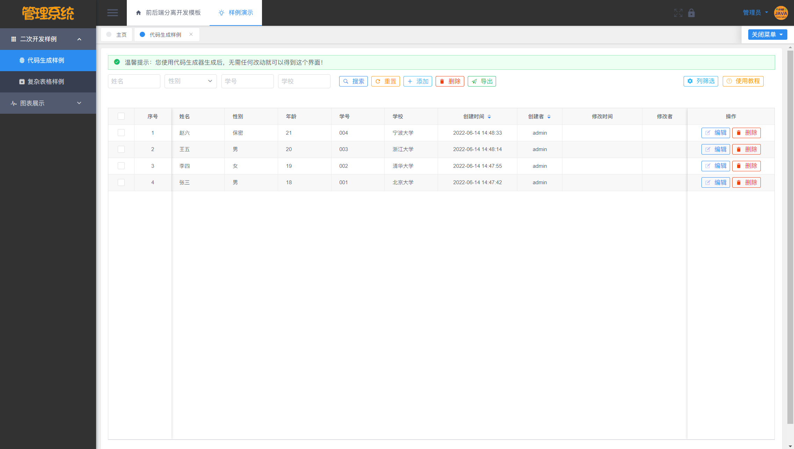

用户可以点击顶部的添加按钮，进入到用户的添加界面，如下图所示。

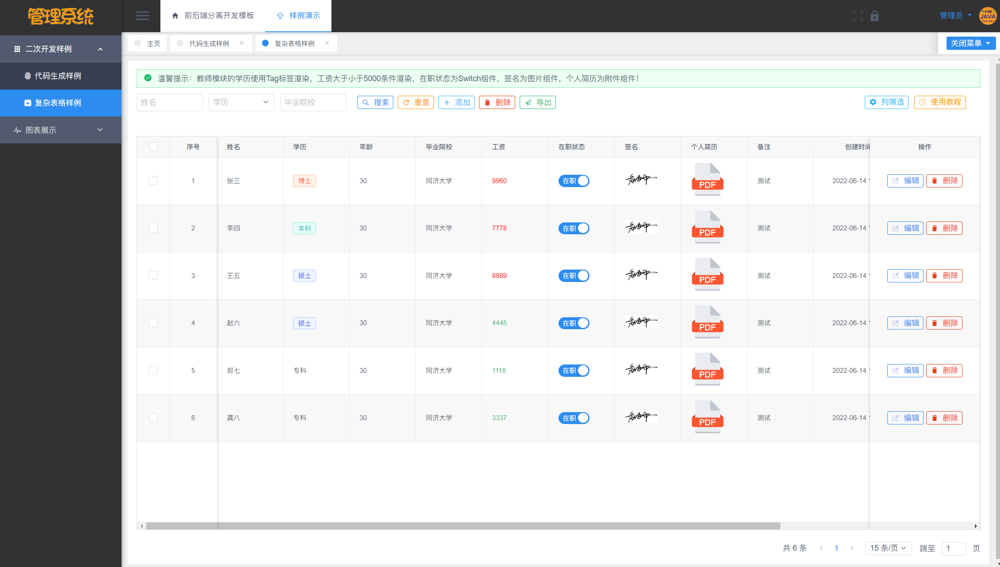

用户可以点击编辑按钮，进入到用户的编辑界面，如下图所示。

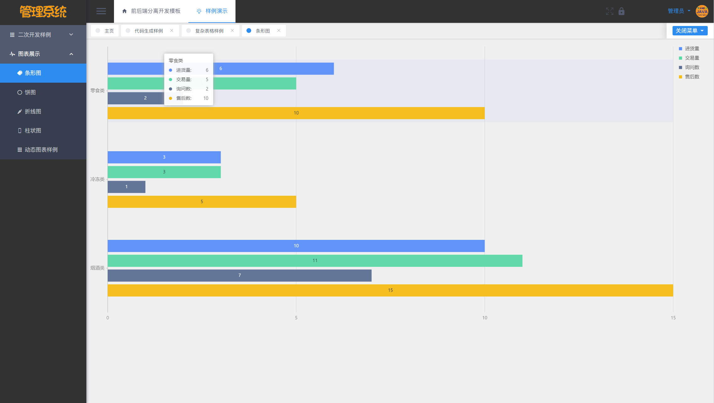

点击删除按钮，系统弹出删除弹框，如下图所示。

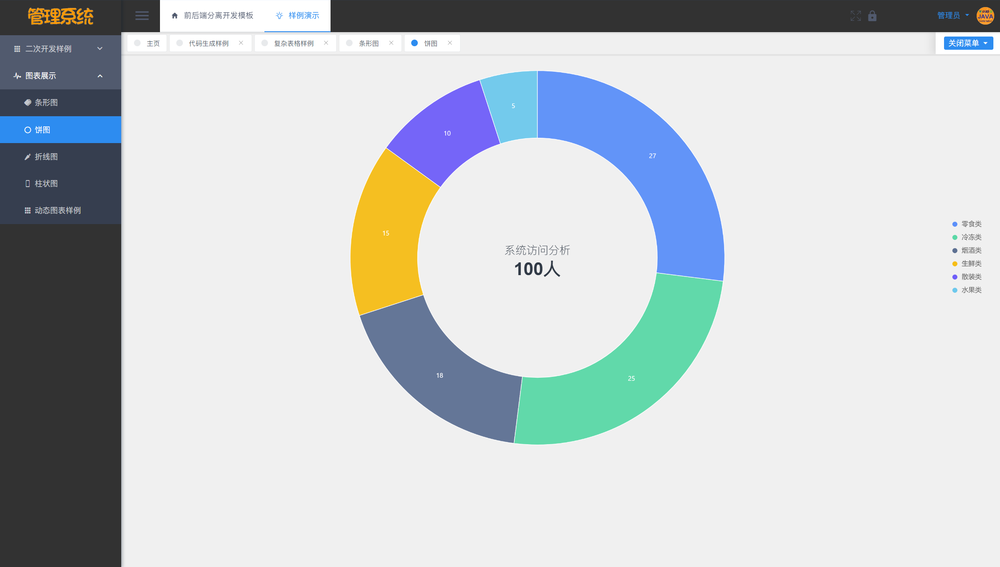

其中删除功能使用了 View UI 的 Modal 组件，可以动态渲染用户的名称，其前端代码如下所示。

```java
// 删除用户前端代码
remove(v) {
    this.$Modal.confirm({
        title: "确认删除",
        content: "删除用户 " + v.username + " ?",
        loading: true,
        onOk: () => {
            deleteUser({
                ids: v.id
            }).then(res => {
                this.$Modal.remove();
                if (res.success) {
                    this.$Message.success("删除成功");
                    this.getUserList();
                }
            });
        }
    });
},
```

## 部门管理模块

部门是用户的一个属性，即用户属于某个部门，一个部门可以拥有多位员工，部门管理模块用于维护部门档案，用户可以新增、编辑、查询、删除和导出部门档案，架构图如下所示。

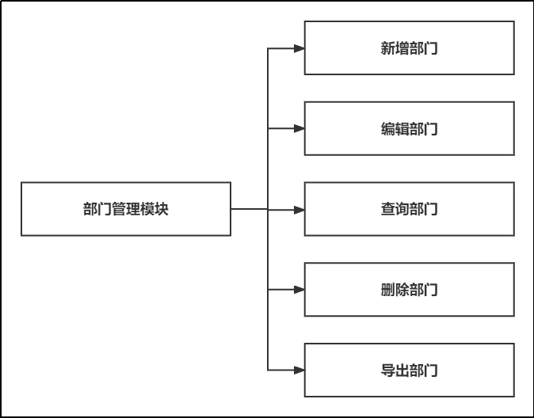

部门实体类的字段明细如下：

- 部门名称

- 部门状态

- 排序值

- 父部门 ID

因为部门档案是一个树形结构的模块，所以设置了父部门 ID。我指定顶级部门的父 ID 为 0，初始状态下前端请求父 ID 为 0 的数据，再使用深度优先搜索（dfs）的方法迭代搜索下面的子部门，从而实现部门管理模块的查询和删除功能，其中深度优先搜索（dfs）的删除部门代码如下所示。

```java
// 深度优先搜索（dfs）的删除部门代码 
@ApiOperation(value = "迭代删除部门")
public void deleteRecursion(String id, String[] ids) {
    QueryWrapper<User> userQw = new QueryWrapper<>();
    userQw.eq("department_id",id);
    long userCountInDepartment = iUserService.count(userQw);
    if(userCountInDepartment > 0L){
        throw new ZwzException("不能删除包含员工的部门");
    }
    Department department = iDepartmentService.getById(id);
    Department parentDepartment = null;
    if(department != null && !ZwzNullUtils.isNull(department.getParentId())){
        parentDepartment = iDepartmentService.getById(department.getParentId());
    }
    iDepartmentService.removeById(id);
    QueryWrapper<DepartmentHeader> dhQw = new QueryWrapper<>();
    dhQw.eq("department_id",id);
    iDepartmentHeaderService.remove(dhQw);
    if(parentDepartment != null){
        QueryWrapper<Department> depQw = new QueryWrapper<>();
        depQw.eq("parent_id",parentDepartment.getId());
        depQw.orderByAsc("sort_order");
        List<Department> childrenDepartmentList = iDepartmentService.list(depQw);
        if(childrenDepartmentList == null || childrenDepartmentList.size() < 1){
            parentDepartment.setIsParent(false);
            iDepartmentService.saveOrUpdate(parentDepartment);
        }
    }
    QueryWrapper<Department> depQw = new QueryWrapper<>();
    depQw.eq("parent_id",id);
    depQw.orderByAsc("sort_order");
    List<Department> departmentList = iDepartmentService.list(depQw);
    for(Department judgeDepartment : departmentList){
        if(!CommonUtil.judgeIds(judgeDepartment.getId(), ids)){
            deleteRecursion(judgeDepartment.getId(), ids);
        }
    }
}
```

部门管理模块的操作界面如下图所示。

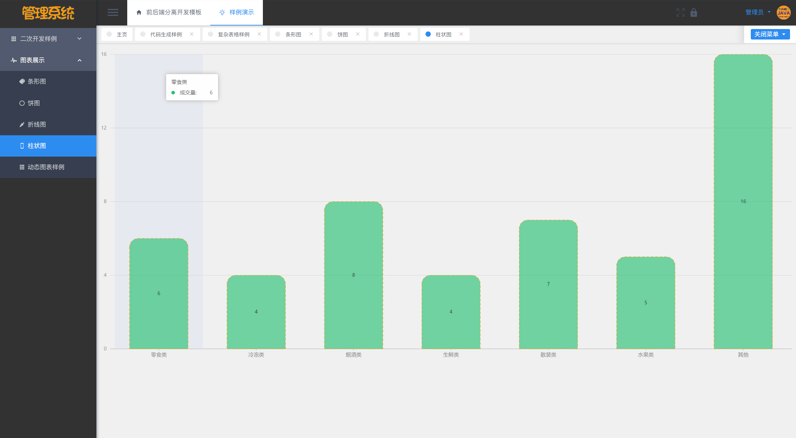

用户可以点击左上角的添加按钮，系统会弹出一个“添加一级部门”界面，添加的部门父 ID 会被指定为 0，也就是顶级的部门。

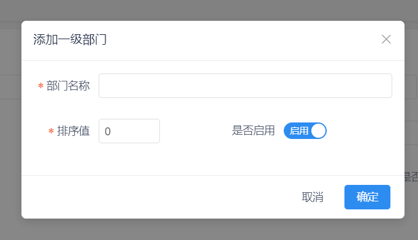

如果用户在左侧树形组件中选择了某个部门（如选择人力资源部），系统会弹出一个“添加部门”界面，添加的部门父 ID 就是当前树形组件选择部门的 ID，从而实现添加子部门的功能。

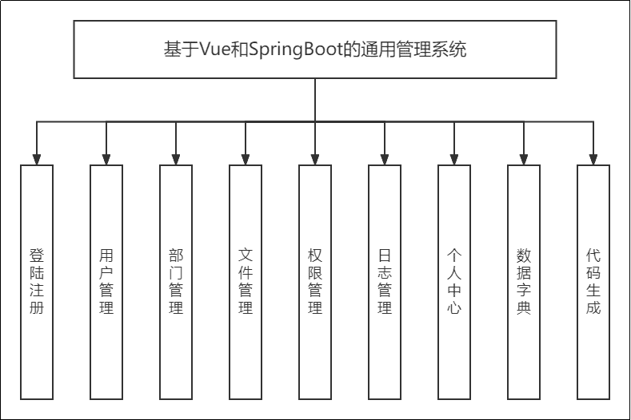

用户可以在右上侧的部门编辑界面中完成对部门信息的编辑操作，最后点击保存按钮即可完成数据更新。

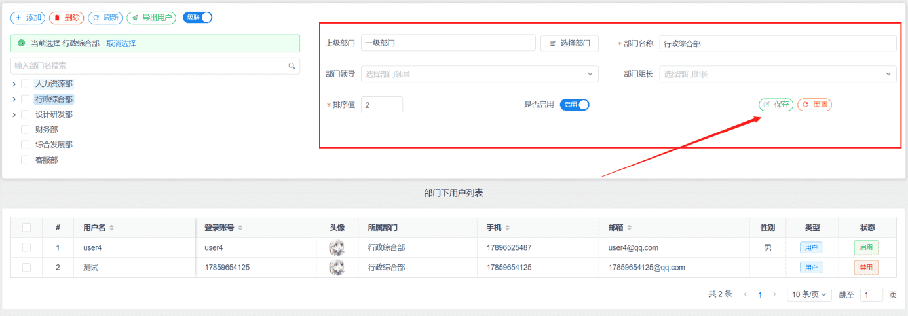

用户也可以在树形组件中勾选部门，然后点击顶部的删除按钮，触发部门的删除操作，如下图所示。

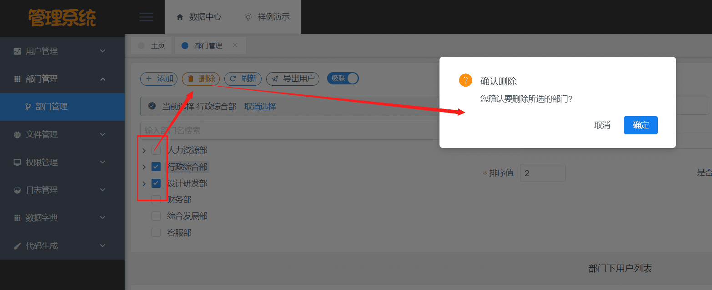

删除部门默认为级联状态，若选择了某个部门，其下层的部门也会被级联选择，若用户不需要此功能，需要关闭级联 Switch 开关，如下图所示。

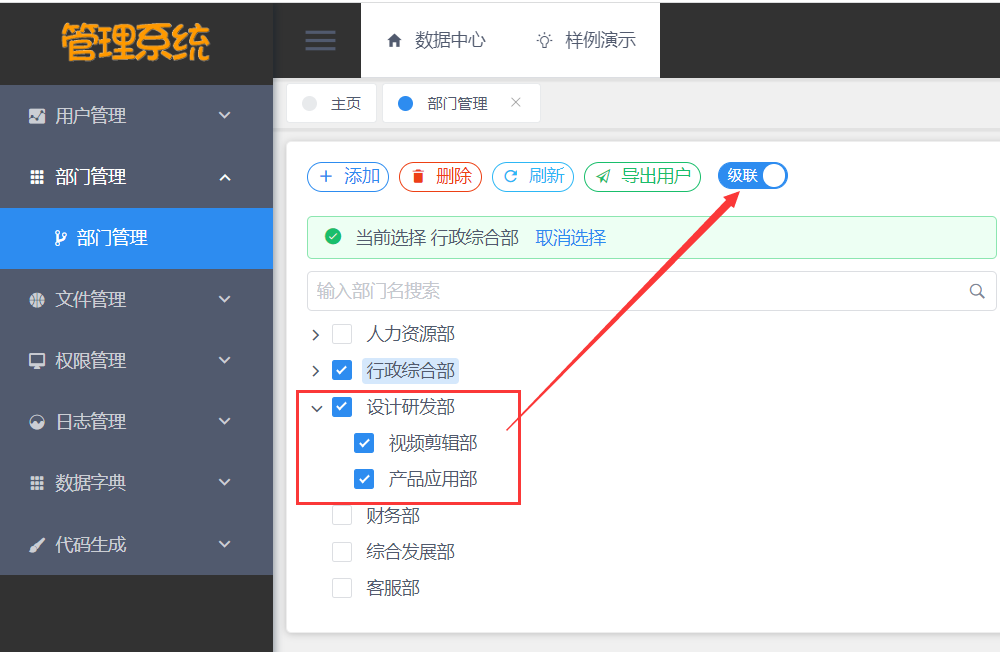

## 文件管理模块

文件存储是大多数管理系统的必备功能，所以基于 Vue 和 SpringBoot 的通用管理系统对文件管理进行了封装，在其他模块上传的文件都会被集成到这个文件管理模块。在这里用户可以对文件进行上传、下载、预览、删除等操作，其架构图如下图所示。

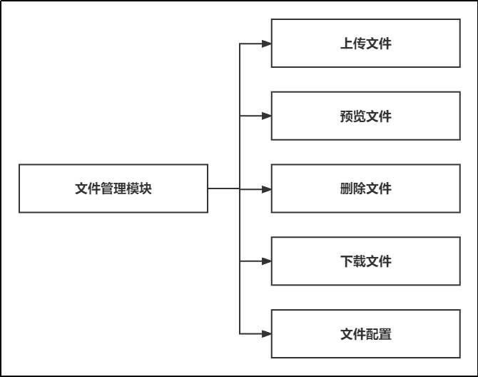

文件实体类的字段明细如下：

- 上传文件名

- 存储路径

- 存储硬盘

- 文件大小

- 实际文件名

- 文件类型

文件管理模块的操作界面如下所示。


在初次部署系统时，用户需要对文件的存储情况进行配置，也就是告诉系统文件放在哪里，还有就是文件的预览端口，文件存储配置的操作界面如下图所示，通过文件管理模块主界面的配置按钮进入。

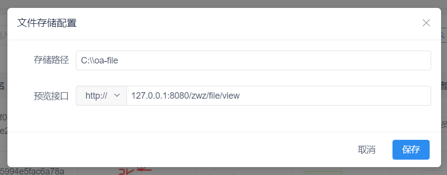

当用户将 a.txt 文件上传到系统中，系统首先会在后端接收到这个文件的内容，将文件命名为 UUID 的随机字符串，持久化到数据库，并且将文件存储到用户配置的磁盘路径，文件上传的后端核心代码如下所示。

```java
// 文件上传核心代码
@SystemLog(about = "文件上传", type = LogType.DATA_CENTER,doType = "FILE-06")
@RequestMapping(value = "/file", method = RequestMethod.POST)
@ApiOperation(value = "文件上传")
public Result<Object> upload(@RequestParam(required = false) MultipartFile file,@RequestParam(required = false) String base64) {
    if(StrUtil.isNotBlank(base64)){
        file = Base64DecodeMultipartFile.base64Convert(base64);
    }
    String result = null;
    String fKey = CommonUtil.renamePic(file.getOriginalFilename());
    File f = new File();
    try {
        InputStream inputStream = file.getInputStream();
        result = zwzFileUtils.inputStreamUpload(inputStream, fKey, file);
        f.setLocation(0);
        f.setName(file.getOriginalFilename());
        f.setSize(file.getSize());
        f.setType(file.getContentType());
        f.setFKey(fKey);
        f.setUrl(result);
        iFileService.saveOrUpdate(f);
    } catch (Exception e) {
        return ResultUtil.error(e.toString());
    }
    OssSettingVo vo = getOssSetting();
    return ResultUtil.data(vo.getFileHttp() + vo.getFileView() + "/" + f.getId());
}
```

当用户需要查询文件的时候，系统根据数据库的数据，匹配到硬盘目录中的文件，回显到前端，回显的后端核心代码如下所示。

```java
// 文件预览核心代码  
@SystemLog(about = "预览文件", type = LogType.DATA_CENTER,doType = "FILE-05")
@RequestMapping(value = "/view/{id}", method = RequestMethod.GET)
@ApiOperation(value = "预览文件")
public void view(@PathVariable String id,@RequestParam(required = false) String filename,@RequestParam(required = false, defaultValue = "false") Boolean preview,HttpServletResponse httpServletResponse) throws IOException {
    File selectFile = iFileService.getById(id);
    if(selectFile == null){
        throw new ZwzException("文件不存在");
    }
    if(ZwzNullUtils.isNull(filename)){
        filename =  selectFile.getFKey();
    }
    if(!preview){
        httpServletResponse.addHeader("Content-Disposition", "attachment; filename=" + URLEncoder.encode(filename, "UTF-8"));
    }
    httpServletResponse.setContentLengthLong(selectFile.getSize());
    httpServletResponse.setContentType(selectFile.getType());
    httpServletResponse.addHeader("Accept-Ranges", "bytes");
    if(selectFile.getSize() != null && selectFile.getSize() > 0){
        httpServletResponse.addHeader("Content-Range", "bytes " + 0 + "-" + (selectFile.getSize()-1) + "/" + selectFile.getSize());
    }
    zwzFileUtils.view(selectFile.getUrl(), httpServletResponse);
}
```

对于图片格式的文件，系统使用了 viewerjs 依赖，后端会返回图片格式的文件流，支持直接预览，预览的效果如下图所示。

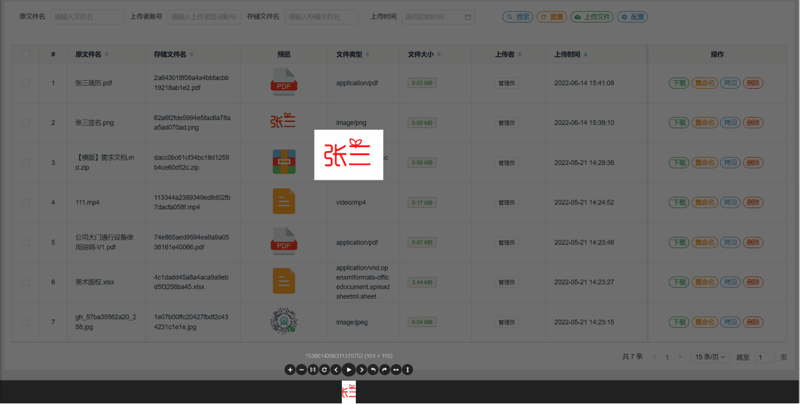

对于其他类型的文件，系统后端会返回文件格式的文件流，浏览器会根据文件类型进行预览或下载，如 PDF 文档会直接触发预览，界面如下所示。

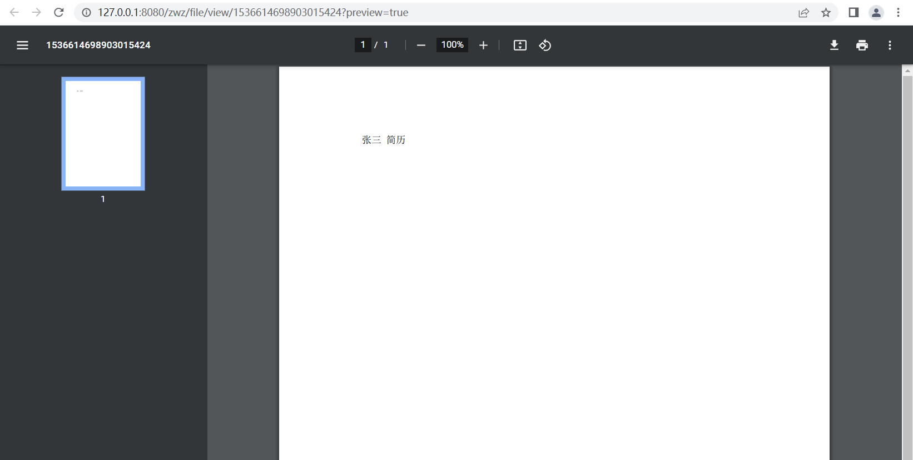

对于不可预览的文件，浏览器会自动触发下载，用户需要下载后使用本地的软件进行预览，如下图所示。

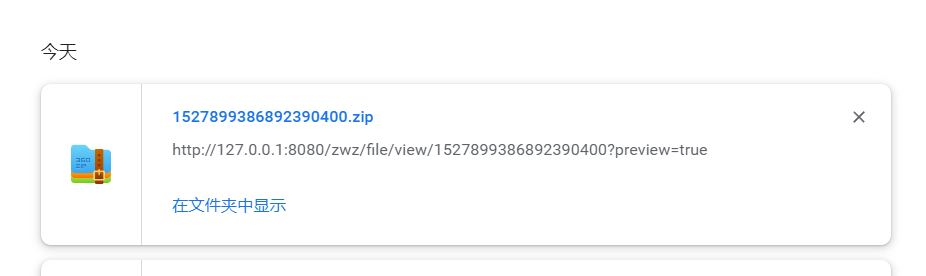

## 权限管理模块

基于 Vue 和 SpringBoot 的通用管理系统采用了基于角色的访问控制，角色和菜单关联，一个角色可以配置多个菜单权限；然后再将用户和角色关联，一位用户可以赋予多个角色。这样用户就可以根据角色拿到该有的菜单权限，更方便管理者进行权限管控，权限管理模块的内容包括了菜单管理模块和角色管理模块，接下来对这两个模块进行介绍。

菜单管理模块用于维护系统的菜单数据，当开发者编写完成指定模块的代码之后，需要整合到系统的路由系统中，这就需要开发者将模块的名称、路由名称、代码路径配置到菜单管理模块，菜单管理模块的主界面如下所示。

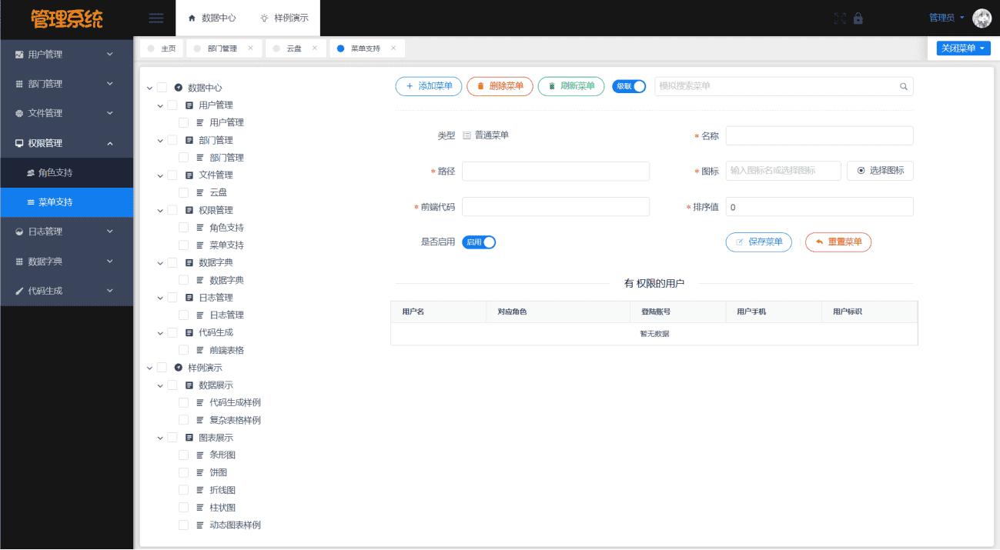

当用户开发完成指定的模块后，需要在菜单管理模块中新建菜单，即点击顶部的添加菜单按钮，系统会弹出添加下单的界面。当用户没有选择左侧树形组件的菜单时，默认添加顶级菜单，若选择了则添加选择菜单的子菜单，相关逻辑和部门管理模块相似，添加菜单的界面如下图所示。

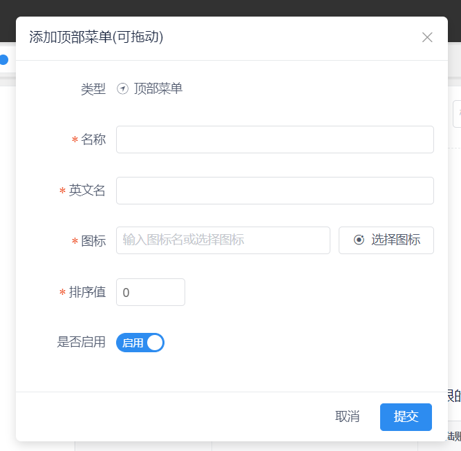

系统页面顶部的为一级菜单，也就是顶级菜单，如下图所示。

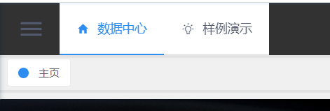

系统左侧展示了二级和三级菜单，如下图所示。

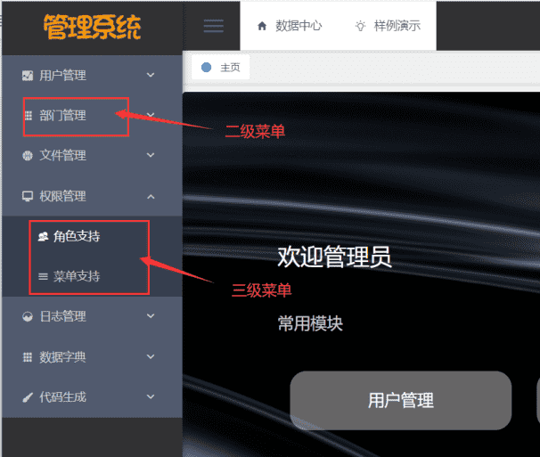

假设用户新建的模块路径为 views/demo/demo1/index，如下图所示。

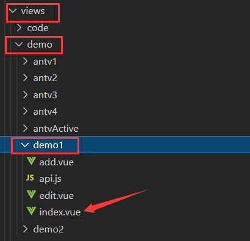

那么用户就需要在前端代码输入组件中输入 demo/demo1/index，完成和前端代码的匹配。另外路径字段和路由英文名字段随意填写，不和现有菜单重复即可。

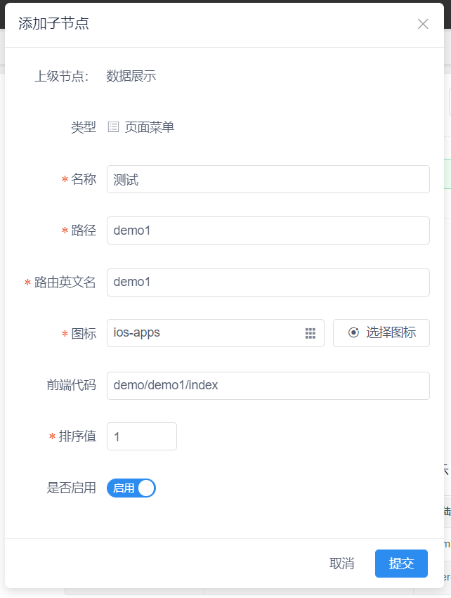

用户也可以在菜单管理模块编辑菜单的数据，编辑完成后点击“保存菜单”按钮即可，如下图所示。

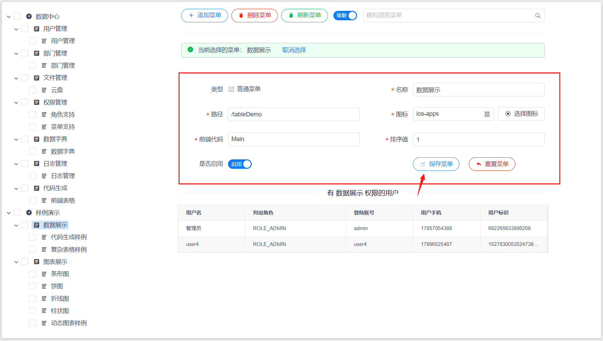

另外系统还支持根据单个菜单查询权限用户的功能，让用户快速知晓这个菜单能够被哪些人看到，这个功能的后端核心代码如下所示。

```java
// 查询菜单权限拥有者核心代码  
@SystemLog(about = "查询菜单权限拥有者", type = LogType.DATA_CENTER,doType = "PERMISSION-01")
@ApiOperation(value = "查询菜单权限拥有者")
@RequestMapping(value = "/getUserByPermission", method = RequestMethod.GET)
public Result<List<UserByPermissionVo>> getUserByPermission(@RequestParam String permissionId){
    Permission permission = iPermissionService.getById(permissionId);
    if(permission == null) {
        return ResultUtil.error("该菜单已被删除");
    }
    List<UserByPermissionVo> ansList = new ArrayList<>();
    // 查询用户
    QueryWrapper<RolePermission> qw = new QueryWrapper<>();
    qw.eq("permission_id",permissionId);
    List<RolePermission> rolePermissionList = iRolePermissionService.list(qw);
    for (RolePermission rp : rolePermissionList) {
        Role role = iRoleService.getById(rp.getRoleId());
        if(role != null) {
            QueryWrapper<UserRole> urQw = new QueryWrapper<>();
            urQw.eq("role_id",role.getId());
            List<UserRole> userRoleList = iUserRoleService.list(urQw);
            for (UserRole ur : userRoleList) {
                User user = iUserService.getById(ur.getUserId());
                if(user != null) {
                    boolean flag = false;
                    for (UserByPermissionVo vo : ansList) {
                        if(Objects.equals(vo.getUserId(),user.getId())) {
                            flag = true;
                            vo.setRoleStr(vo.getRoleStr() + role.getName() + "(" + role.getDescription() + ") ");
                            break;
                        }
                    }
                    if(!flag) {
                        UserByPermissionVo vo = new UserByPermissionVo();
                        vo.setUserId(user.getId());
                        vo.setUserName(user.getNickname());
                        vo.setRoleStr(role.getName());
                        vo.setCode(user.getUsername());
                        vo.setMobile(user.getMobile());
                        ansList.add(vo);
                    }
                }
            }
        }
    }
    return new ResultUtil<List<UserByPermissionVo>>().setData(ansList);
}
```

对于角色管理模块而言，存在的意义就是实现基于角色的访问控制，操作界面如下图所示。

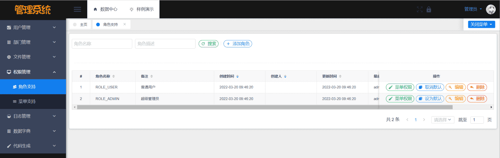

用户可以对角色分配权限菜单，分配后有这个角色的用户就可以进入配置的菜单，进行相关的操作，菜单权限分配界面如下图所示，用户分配完成后点击底部的保存菜单权限按钮即可完成更新操作。

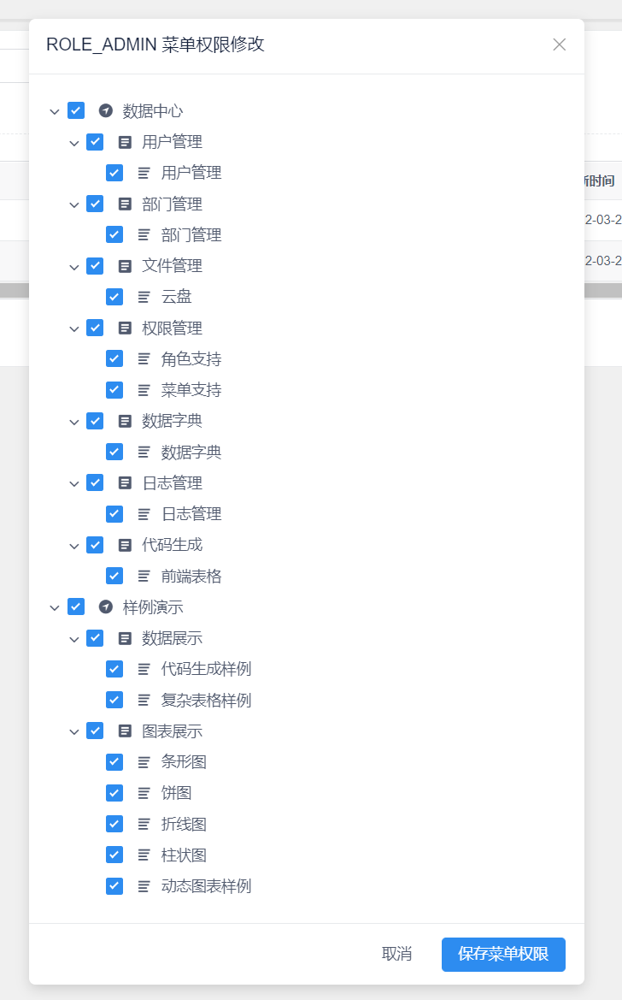

用户还可以对角色进行设置默认操作，设置默认角色后，新注册的用户会被赋予该角色，拥有这个角色的菜单权限，默认角色支持有多个。

## 日志管理模块

日志管理模块用于记录用户的操作记录，以便于留证，这也是大多数管理系统必备的基础功能。日志管理模块的操作界面如下图所示。


日志档案的实体类包括了以下字段。

- 日志名称

- 日志类型

- 日志代码

- 设备

- 请求 URL

- 请求参数

- 请求方式

- 参数

- IP 地址

- IP 定位

- 消耗时间

其中 IP 定位功能是调用腾讯地图的接口实现，即根据 IP 获取对应的区县数据，每个个人开发者每天有 5000 次调取权限。

日志管理模块的顶部使用了 View UI 的 Tabs 标签组件，用户可以点击完成动态切换，如下图所示。

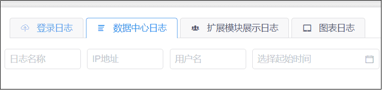

日志功能使用了 Spring Boot 的 AOP 思想（面向切面编程）实现，当后端的某个方法打上日志注解后，当方法执行前、执行完成后会执行自定义的事件，从而完成对系统操作的记录功能。其中执行完成后的事件代码如下所示。

```java
// 执行完成后的事件代码
@ApiOperation(value = "后置通知")
@AfterReturning("controllerAspect()")
public void after(JoinPoint joinPoint){
    try {
        String username = "";
        String description = getControllerMethodInfo(joinPoint).get("description").toString();
        int type = (int)getControllerMethodInfo(joinPoint).get("type");
        String doType = getControllerMethodInfo(joinPoint).get("doType").toString();
        Map<String, String[]> logParams = request.getParameterMap();
        Object principal = SecurityContextHolder.getContext().getAuthentication().getPrincipal();
        if(Objects.equals("anonymousUser",principal.toString())){
            return;
        }
        String device = "", isMobile = "PC端";
        UserAgent ua = UserAgentUtil.parse(request.getHeader("user-agent"));
        if (ua != null) {
            if (ua.isMobile()) {
                isMobile = "移动端";
            }
            device = isMobile + " | " + ua.getBrowser().toString() + " " + ua.getVersion() + " | " + ua.getPlatform().toString() + " " + ua.getOs().toString();
        }
        UserDetails user = (UserDetails) principal;
        String str = redisTemplate.get(REDIS_USER_PRE + user.getUsername());
        if(str != null) {
            username = str;
        } else {
            username = user.getUsername();
        }
        Log log = new Log();
        log.setUsername(username);
        log.setName(description);
        log.setLogType(type);
        log.setCode(doType);
        log.setRequestUrl(request.getRequestURI());
        log.setRequestType(request.getMethod());
        log.setMapToParams(logParams);
        log.setIp(ipInfoUtil.getRequestIpAddress(request));
        log.setDevice(device);
        log.setIpInfo(ipInfoUtil.getIpCity(request));
        Long logElapsedTime = System.currentTimeMillis() - beginTimeThreadLocal.get().getTime();
        log.setCostTime(logElapsedTime.intValue());
        ThreadPoolUtil.getPool().execute(new SaveSystemLogThread(log, logService));
    } catch (Exception e) {
        log.error("日志异常", e);
    }
}
```

## 个人中心模块

个人中心模块用于用户对自己的资料进行设置功能，如设置自己的家庭地址、生日、个性签名等等，另外还支持对首页的常用菜单进行配置，个人中心模块的操作界面如下所示。

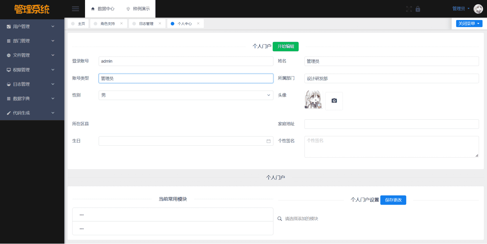

在首页模块中，展示了用户在个人中心配置的常用模块，用户可以点击模块按钮，即可直接进入这个模块，无需再按层级选择菜单，操作界面如下所示。


```java
// 常用模块的跳转代码
selectItem(e) {
    if (e.name != undefined && e.name != "null") {
        this.$router.push({
            name: e.name,
        });
    }
}
```

## 数据字典模块

数据字典模块是用于对其他模块提供下拉数据支持，如用户管理模块中的性别字段，其下拉框的数据来源就是在数据字典模块的性别值。

用户管理模块的性别选择栏如下图所示。

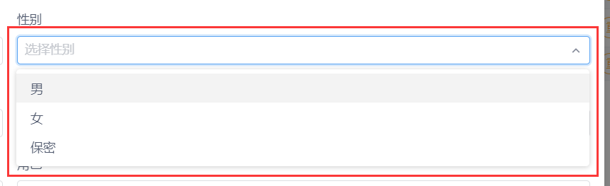

数据字典模块的性别数据界面如下所示。

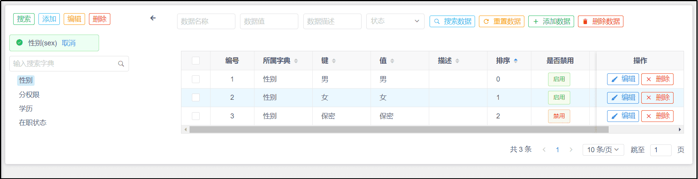

用户可以在数据字典模块中维护相应的数据，以便于给其他模块提供数据支持。系统对数据字典功能进行了封装，当前端模块需要引用数据字典时，只需要导入 dict 组件即可完成引用，配置非常方便，其中 dict 字段为数据字典模块的配置的字典值，v-model 字段为前端模块双向数据绑定的变量，相关代码如下所示。

```java
// 数据字典的核心代码
// 第一步 导入
import dict from "@/views/template/dict";

// 第二步 引用
<dict dict="sex" v-model="form.sex" transfer clearable placeholder="选择性别" />
```

## 代码生成模块

代码生成是基于 Vue 和 SpringBoot 的通用管理系统的一大特色，可以帮助开发者快速生成前后端增删改查的基础代码，基于 beetl 依赖实现。

对于用户而言，当需要新建一个模块时，只需要定义类的名称和备注，运行 main 方法即可完成代码创建，代码生成器的后端代码如下图所示。

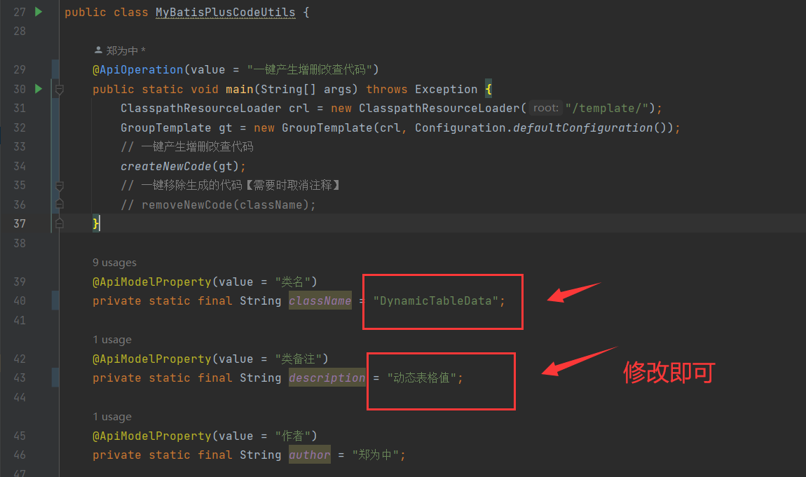

运行后，系统后端会自动生成对应的代码模块，包括 controller 控制器、entity 实体类、mapper 数据链路层、service 服务层和 serviceimpl 服务层实现。

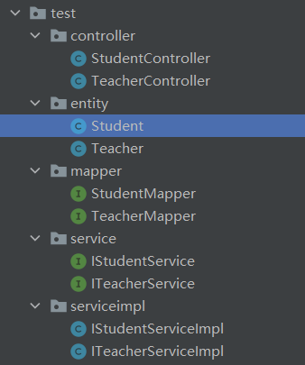

接着开发者需要完善模块的字段列表，完善后运行后端程序即可，系统会自动在 MySQL 中创建表和字段。

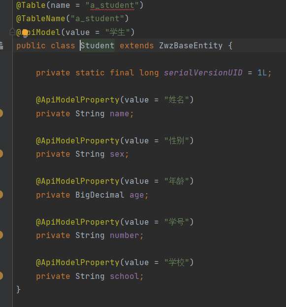

如开发者创建的实体类路径为 cn.zwz.test.entity.Student，则只需在“读取字段”面板中输入这个路径，点击读取字段按钮，系统会基于 Java 的反射读到该实体类的字段，如下图所示。

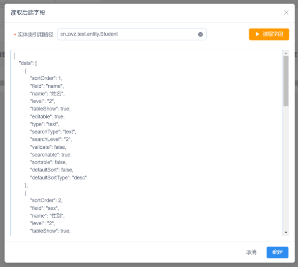

开发者再点击确认按钮，即可将读取到的字段转换为 Table 数据，如下图所示。

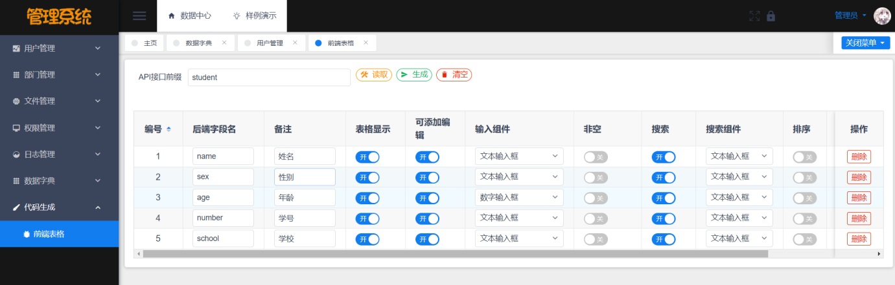

开发者可以根据业务实际需求，改变每个字段的类型，最后点击“生成”按钮，即可完成前端代码生成，如下图所示。

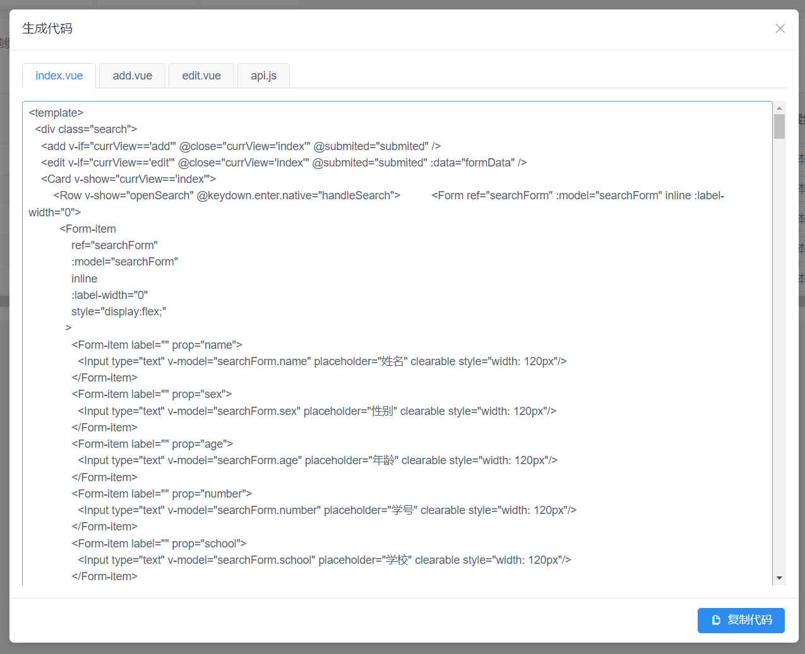

开发者将自动生成的代码复制到指定附录，配置到菜单管理模块下，就可以看到支持增删改查的功能模块界面，如下图所示。

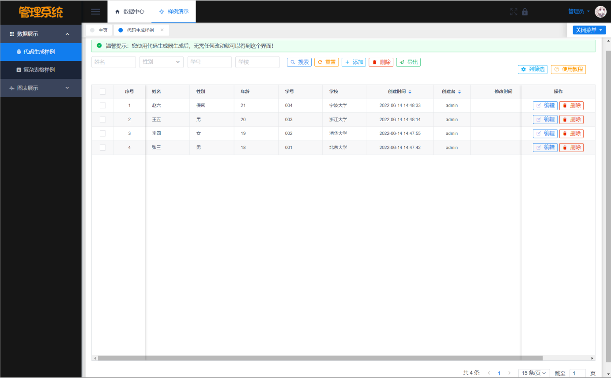

## 项目总结

本软件是基于 Vue 和 SpringBoot 的通用管理系统，包含了登陆注册、用户管理、部门管理、文件管理、权限管理、日志管理、个人中心、数据字典和代码生成这九个功能模块。

开发这套系统的目的，就是为了帮助开发者提高开发效率，可以更加专注的实现业务逻辑，从而提高开发人员的工作效率。

## 免责声明

- 本项目开源，仅供个人学习使用，遵循 GPL-3.0 开源协议，**转发 / 商用授权请联系作者，否则后果自负**。
- 作者拥有本软件构建后的应用系统全部内容所有权及独立的知识产权（**软件著作权登记号：2022SR1338865**）。
- 如有问题，欢迎在仓库 Issue 留言，看到后会第一时间回复。相关意见会酌情考虑，但没有一定被采纳的承诺或保证。

下载本系统代码的用户，**必须同意以下内容，否则请勿下载**！

1. 出于自愿而使用/开发本软件，了解使用本软件的风险，且同意自己承担使用本软件的风险。
2. 利用本软件构建的网站的任何信息内容以及导致的任何版权纠纷和法律争议及后果和作者无关，作者对此不承担任何责任。
3. 在任何情况下，对于因使用或无法使用本软件而导致的任何难以合理预估的损失（包括但不仅限于商业利润损失、业务中断与业务信息丢失），作者概不承担任何责任。
4. 必须了解使用本软件的风险，作者不承诺提供一对一的技术支持、使用担保，也不承担任何因本软件而产生的难以预料的问题的相关责任。